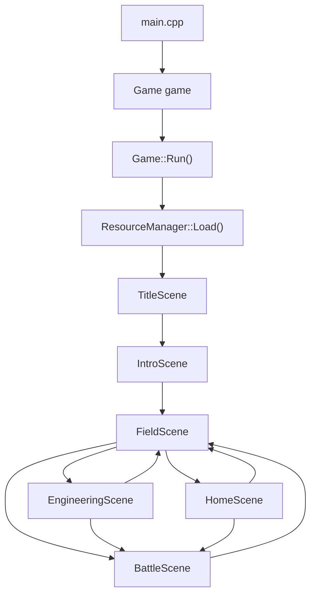

# 객체지향 구조 분석 문서

과목명: 객체지향주의프로그래밍  
프로젝트: `CPP_Project`

## 1. 문서 목적

이 문서는 현재 게임 코드가 어떤 흐름으로 실행되는지, 각 파일과 클래스가 어떤 책임을 가지는지, 그리고 이 코드에서 객체지향 개념이 어떻게 사용되었는지 설명하기 위한 문서이다.

발표나 보고서에서는 다음 문장으로 전체 구조를 요약할 수 있다.

> 이 게임은 `Game` 객체가 전체 실행 루프와 공통 데이터를 관리하고, 각 화면은 `IScene` 인터페이스를 상속한 독립적인 Scene 클래스로 구현된다. 실행 중에는 현재 Scene의 `Update()`와 `Draw()`가 다형적으로 호출되며, Scene 전환은 `std::unique_ptr<IScene>`를 통해 이루어진다.

## 2. 전체 파일 구조

### 실행과 전체 관리

| 파일 | 역할 |
| --- | --- |
| `main.cpp` | 프로그램 시작점. `Game` 객체를 만들고 `Run()`을 호출한다. |
| `Game.h`, `Game.cpp` | 게임 창 생성, 메인 루프, Scene 전환, 공통 데이터와 리소스 소유를 담당한다. |
| `Scene.h` | 모든 Scene이 따라야 하는 공통 인터페이스 `IScene`를 정의한다. |
| `GameData.h` | 플레이어 정보, 학기 정보, 엔딩/시험/전투 상태 같은 게임 데이터를 담는다. |
| `ResourceManager.h`, `ResourceManager.cpp` | 폰트, 플레이어/적 스프라이트, NPC 초상화, 장면 배경 같은 리소스를 로드하고 해제한다. |

### 화면 단위 Scene

| 파일 | 역할 |
| --- | --- |
| `TitleScene.h`, `TitleScene.cpp` | 타이틀 화면. 게임 데이터를 초기화하고 인트로로 진입한다. |
| `IntroScene.h`, `IntroScene.cpp` | 조작 안내와 도입 대사를 출력한다. 끝나면 필드로 이동한다. |
| `FieldScene.h`, `FieldScene.cpp` | 캠퍼스 필드. 공학관, 술자리, 집, 시간 넘기기 진입을 담당한다. |
| `EngineeringScene.h`, `EngineeringScene.cpp` | 공학관 내부. 수업, 선배, 시험 선택지를 처리한다. |
| `HomeScene.h`, `HomeScene.cpp` | 집 내부. 게임하기, 자기, 과제 수행하기, 학교 가기를 처리한다. |
| `BattleScene.h`, `BattleScene.cpp` | 과제 또는 시험 전투를 처리한다. |
| `UiWidgets.h`, `UiWidgets.cpp` | 여러 Scene에서 공통으로 쓰는 상태 UI, 게이지 UI, 플레이어 스프라이트, 화면 배경을 그린다. |

## 3. 실행 흐름

게임은 `main.cpp`에서 시작한다.

```cpp
int main()
{
    Game game;
    game.Run();
    return 0;
}
```

즉, 실제 게임 실행 책임은 `Game` 클래스에 있다.

`Game::Run()`의 흐름은 다음과 같다.

1. `InitWindow()`로 raylib 창을 연다.
2. `resources.Load()`로 폰트와 이미지 리소스를 로드한다.
3. 첫 Scene을 `TitleScene`으로 설정한다.
4. 게임이 종료될 때까지 반복한다.
5. 매 프레임 현재 Scene의 `Update()`를 호출한다.
6. 매 프레임 현재 Scene의 `Draw()`를 호출한다.
7. 종료 시 리소스를 해제하고 창을 닫는다.

흐름을 그림으로 표현하면 다음과 같다.



## 4. Scene 구조

모든 화면은 `IScene` 인터페이스를 상속한다.

```cpp
class IScene
{
public:
    virtual ~IScene() = default;

    virtual void Enter(Game& game) {}
    virtual void Update(Game& game, float dt) = 0;
    virtual void Draw(Game& game) = 0;
};
```

각 함수의 의미는 다음과 같다.

| 함수 | 의미 |
| --- | --- |
| `Enter(Game& game)` | Scene에 처음 들어올 때 실행된다. 초기 위치, 메시지, 상태 초기화에 사용한다. |
| `Update(Game& game, float dt)` | 매 프레임 입력과 게임 로직을 처리한다. |
| `Draw(Game& game)` | 매 프레임 화면에 그래픽과 UI를 그린다. |

`TitleScene`, `IntroScene`, `FieldScene`, `EngineeringScene`, `HomeScene`, `BattleScene`은 모두 `IScene`을 상속하고, 각자 자기 화면에 맞는 `Update()`와 `Draw()`를 구현한다.

이 구조 덕분에 `Game` 클래스는 현재 화면이 타이틀인지, 전투인지, 집인지 몰라도 된다. 그냥 `currentScene->Update()`와 `currentScene->Draw()`만 호출하면 된다.

## 5. Scene 전환 방식

Scene 전환은 `Game::ChangeScene()`으로 요청한다.

```cpp
void Game::ChangeScene(std::unique_ptr<IScene> scene)
{
    nextScene = std::move(scene);
}
```

바로 바꾸지 않고 `nextScene`에 저장한 뒤, 루프 안에서 `ApplySceneChange()`가 실제 전환을 수행한다.

```cpp
void Game::ApplySceneChange()
{
    if (nextScene)
    {
        currentScene = std::move(nextScene);
        currentScene->Enter(*this);
    }
}
```

이 방식의 장점은 다음과 같다.

- Scene 전환 중에도 메모리 소유권이 명확하다.
- `std::unique_ptr`를 사용하므로 이전 Scene은 자동으로 정리된다.
- 새 Scene에 들어갈 때 `Enter()`를 한 번 호출하여 초기화를 일관되게 수행할 수 있다.

예시:

```cpp
game.ChangeScene(std::make_unique<HomeScene>());
game.ChangeScene(std::make_unique<BattleScene>());
game.ChangeScene(std::make_unique<FieldScene>());
```

## 6. 데이터 구조

게임 데이터는 `GameData`가 한 번에 가진다.

```cpp
struct GameData
{
    PlayerData player;
    SemesterData semester;
    bool hasPotion = true;
    bool bossDefeated = false;
};
```

`GameData`는 다시 `PlayerData`와 `SemesterData`로 나뉜다.

### PlayerData

플레이어의 전투와 이동 관련 정보이다.

- `position`: 캠퍼스 필드에서 플레이어 위치
- `hp`, `maxHp`: 멘탈
- `attack`: 공격력
- `level`: 레벨
- `speed`: 이동 속도

필드에서는 기본 플레이어 스프라이트 크기인 `36 x 36`을 사용한다. 공학관 내부와 집 내부는 배경 이미지의 스케일에 맞추기 위해 플레이어 스프라이트와 상호작용 판정 박스를 `144 x 144`로 확대해서 사용한다.

### SemesterData

학기 진행과 성적 관련 정보이다.

- `week`: 현재 주차
- `isNight`: 낮/밤 상태
- `assignmentMisses`: 과제 미제출 누적 횟수
- `absences`: 결석 누적 횟수
- `devPower`: 개발력
- `network`: 인맥
- `maxActionPoints`: 하루 최대 행동력
- `actionPoints`: 행동력
- `foughtToday`: 과제 전투 수행 여부
- `tookExamToday`: 시험 수행 여부
- `currentBattleIsExam`: 현재 전투가 시험인지 과제인지 구분하는 플래그
- `attendedClassToday`: 오늘 수업을 들었는지 여부
- `homeActionsUsedTonight`, `drinksTonight`: 밤 행동과 술자리 이용 횟수
- `midtermExamDebuff`, `midtermPresentationDebuff`, `finalExamDebuff`, `finalPresentationDebuff`: 주차 이벤트로 발생한 디버프 상태
- `gameEnded`, `passed`: 엔딩 처리 상태
- `endingName`: 최종 엔딩 이름

중요한 점은 `Game`이 `GameData data`를 소유하고, 각 Scene은 `game.Data()`를 통해 같은 데이터를 읽고 수정한다는 것이다.

## 7. 주요 Scene별 책임

### TitleScene

타이틀 화면이다.

주요 책임:

- 게임 시작 전 데이터를 초기화한다.
- `ENTER` 입력을 받으면 `IntroScene`으로 전환한다.
- 타이틀 UI를 그린다.

객체지향 관점에서는 `TitleScene`이 타이틀 화면에 필요한 로직만 가진다. 다른 Scene의 세부 구현을 알 필요가 없다.

### IntroScene

도입 안내와 대사를 처리하는 화면이다.

주요 책임:

- `Phase` enum으로 안내 화면과 대사 화면을 구분한다.
- `DialogueLine` 구조체로 화자와 대사를 묶어서 관리한다.
- 대사가 끝나면 `FieldScene`으로 전환한다.

여기서는 대사 진행 상태를 `IntroScene` 내부에 캡슐화하고 있다.

### FieldScene

캠퍼스의 중심 필드이다.

주요 책임:

- 플레이어 이동 처리
- 공학관, 술자리, 집, 시간 넘기기 영역 충돌 확인
- 낮/밤 상태에 따라 `Smu_Day.png` 또는 `Smu_Night.png` 배경 출력
- 낮에서 밤으로 전환
- 밤에서 다음 주로 전환
- 결석/과제 미제출 누적 처리
- 8주차/15주차 시험 미응시 시 `F` 엔딩 처리
- 15주차 종료 시 `A+`, `B+`, `C` 엔딩 계산

`FieldScene` 내부에는 `TimeTransition` enum이 있어, 화면 전환 페이드 상태를 관리한다.

```cpp
enum class TimeTransition
{
    None,
    FadeInOnly,
    ToNight,
    ToNextWeek
};
```

이것은 `FieldScene` 내부에서만 필요한 상태이므로 `private` 영역에 숨겨져 있다.

### EngineeringScene

공학관 내부 화면이다.

주요 책임:

- 수업 선택지 처리
- 선배 선택지 처리
- 8주차/15주차에만 시험 선택지 표시
- 시험 선택 시 `currentBattleIsExam = true`로 설정하고 `BattleScene`으로 전환
- `GongHak.png` 배경 출력
- 공학관 배경 스케일에 맞춰 플레이어 스프라이트와 상호작용 판정을 `144 x 144`로 사용

수업을 들으면 개발력이 증가한다.

```cpp
s.devPower += 2;
```

선배와 대화하면 인맥이 증가한다.

```cpp
s.network += 1;
```

시험은 특정 주차에서만 표시된다.

```cpp
bool IsExamWeek(int week)
{
    return week == 8 || week == 15;
}
```

### HomeScene

집 내부 화면이다.

주요 책임:

- 게임하기: 멘탈 회복
- 자기: 멘탈을 조금 회복하고 다음 주로 이동
- 과제 수행하기: 일반 과제 전투 진입
- 학교 가기: 캠퍼스 필드로 복귀
- 다음 주로 넘어갈 때 시험 미응시 여부와 최종 엔딩 확인
- `Home.png` 배경 출력
- 집 배경 스케일에 맞춰 플레이어 스프라이트와 상호작용 판정을 `144 x 144`로 사용

집에서 과제를 수행할 때는 일반 전투이므로 다음처럼 설정한다.

```cpp
s.currentBattleIsExam = false;
game.ChangeScene(std::make_unique<BattleScene>());
```

### BattleScene

전투 화면이다.

주요 책임:

- 플레이어 턴과 적 턴 관리
- 공격/회복 입력 처리
- 승리/패배 상태 처리
- 전투 승리 시 레벨, 최대 멘탈, 공격력 증가
- 현재 전투가 과제인지 시험인지에 따라 다른 플래그 설정

전투 상태는 `BattleState` enum으로 관리된다.

```cpp
enum class BattleState
{
    PlayerTurn,
    EnemyTurn,
    Victory,
    Defeat
};
```

승리 시 현재 전투가 시험이면 `tookExamToday`를 켜고, 일반 과제면 `foughtToday`를 켠다.

```cpp
if (data.semester.currentBattleIsExam)
    data.semester.tookExamToday = true;
else
    data.semester.foughtToday = true;
```

즉 `BattleScene` 하나를 과제 전투와 시험 전투가 함께 사용한다. 이것은 같은 전투 로직을 재사용하는 구조이다.

## 8. 객체지향 개념이 적용된 부분

### 1. 캡슐화

각 클래스는 자기 책임에 필요한 데이터와 함수를 내부에 가진다.

예를 들어 `FieldScene`은 필드에서만 필요한 영역 좌표, 메시지 상태, 대화 상태, 시간 전환 상태를 `private` 멤버로 가진다.

```cpp
Rectangle engineeringZone;
Rectangle barZone;
Rectangle homeZone;
Rectangle nextZone;
TimeTransition timeTransition;
```

외부에서는 이 값들을 직접 조작하지 않고, `Update()`와 `Draw()`를 통해 동작 결과만 보게 된다.

### 2. 추상화

`IScene`은 모든 화면이 가져야 할 공통 기능을 추상화한다.

```cpp
virtual void Enter(Game& game) {}
virtual void Update(Game& game, float dt) = 0;
virtual void Draw(Game& game) = 0;
```

`Game`은 구체적인 Scene의 종류를 몰라도 된다. 모든 Scene을 `IScene` 타입으로 다룬다.

### 3. 상속

각 화면 클래스는 `IScene`을 상속한다.

```cpp
class TitleScene : public IScene
class FieldScene : public IScene
class HomeScene : public IScene
class BattleScene : public IScene
```

공통 인터페이스를 상속받고, 각 Scene이 자기 방식대로 `Update()`와 `Draw()`를 구현한다.

### 4. 다형성

`Game`은 현재 Scene을 `std::unique_ptr<IScene>`으로 보관한다.

```cpp
std::unique_ptr<IScene> currentScene;
```

그리고 매 프레임 다음처럼 호출한다.

```cpp
currentScene->Update(*this, dt);
currentScene->Draw(*this);
```

실제 객체가 `TitleScene`이면 타이틀 로직이 실행되고, `BattleScene`이면 전투 로직이 실행된다. 같은 함수 호출이지만 실제 동작은 객체의 종류에 따라 달라진다. 이것이 다형성이다.

### 5. 합성

`Game`은 여러 객체를 멤버로 포함한다.

```cpp
GameData data;
ResourceManager resources;
std::unique_ptr<IScene> currentScene;
```

`GameData`도 다시 `PlayerData`와 `SemesterData`를 포함한다.

```cpp
struct GameData
{
    PlayerData player;
    SemesterData semester;
};
```

이처럼 큰 객체가 작은 객체들을 포함하여 전체 기능을 구성하는 방식이 합성이다.

### 6. 리소스 관리

`ResourceManager`는 폰트와 이미지 리소스 로드/해제를 담당한다.

```cpp
void Load();
void Unload();
Font& UiFont();
Texture2D& CampusDayBackground();
Texture2D& HomeBackground();
```

폰트, 스프라이트, 초상화, 배경 이미지를 어디서 어떻게 불러오는지 Scene들이 직접 알 필요가 없다. Scene은 `game.Resources().UiFont()` 또는 `game.Resources().HomeBackground()`처럼 필요한 리소스 접근자만 사용하면 된다.

현재 배경 리소스는 다음처럼 Scene과 연결된다.

| 배경 파일 | 사용 Scene |
| --- | --- |
| `assets/background/Smu_Day.png` | 낮 캠퍼스 필드 |
| `assets/background/Smu_Night.png` | 밤 캠퍼스 필드 |
| `assets/background/GongHak.png` | 공학관 내부 |
| `assets/background/Home.png` | 집 내부 |

`NoTxt` 또는 `Notxt` 버전 배경은 비교용 자산으로 남겨두고, 현재 코드는 텍스트가 포함된 버전을 우선 사용한다.

### 7. 스마트 포인터를 이용한 소유권 관리

Scene은 `std::unique_ptr<IScene>`으로 관리된다.

```cpp
game.ChangeScene(std::make_unique<FieldScene>());
```

`unique_ptr`는 한 객체의 소유자가 하나뿐임을 보장한다. Scene이 바뀔 때 이전 Scene은 자동으로 정리되므로 메모리 누수를 줄일 수 있다.

## 9. 게임 진행 로직 요약

### 기본 진행

1. `TitleScene`에서 시작한다.
2. `IntroScene`에서 안내와 대사를 본다.
3. `FieldScene`으로 이동한다.
4. 낮에는 공학관에서 수업/선배/시험을 선택할 수 있다.
5. 시간 넘기기로 밤이 된다.
6. 밤에는 술자리나 집을 이용할 수 있다.
7. 집에서 자면 다음 주로 넘어간다.
8. 15주차가 끝나면 스탯에 따라 엔딩이 정해진다.

### 스탯 증가

| 행동 | 증가 |
| --- | --- |
| 수업 | 개발력 +2 |
| 선배 | 인맥 +1 |
| 술자리 | 인맥 +2 |
| 과제/시험 전투 승리 | 레벨 +1, 최대 멘탈 +2, 공격력 +1 |

### 시험 규칙

8주차와 15주차에는 공학관 안에 `시험` 선택지가 생긴다.

시험을 선택하면 `BattleScene`으로 이동하지만, 전투 플래그는 시험으로 설정된다.

```cpp
s.currentBattleIsExam = true;
```

시험 전투에서 이기면 다음 값이 켜진다.

```cpp
s.tookExamToday = true;
```

해당 주에 시험을 치르지 않고 다음 주 또는 엔딩으로 넘어가려고 하면 `F` 엔딩이 된다.

### 엔딩 규칙

15주차 종료 시 다음 기준으로 엔딩이 정해진다.

| 조건 | 엔딩 |
| --- | --- |
| 개발력 >= 50 그리고 인맥 >= 35 | A+ |
| 개발력 >= 30 그리고 인맥 >= 20 | B+ |
| 그 아래 | C |
| 8주차/15주차 시험 미응시 | F |
| 과제 미제출 누적 5회 | F |
| 결석 누적 4회 | F |

## 10. 발표용 객체지향 설명 예시

발표에서 그대로 말하기 좋은 형태로 정리하면 다음과 같다.

> 저희 게임은 화면 단위를 Scene 객체로 나누어 구현했습니다. `IScene`이라는 공통 인터페이스를 만들고, 타이틀, 인트로, 필드, 공학관, 집, 전투 화면이 모두 이 인터페이스를 상속하도록 했습니다.  
>  
> `Game` 클래스는 현재 Scene을 `IScene` 포인터로 들고 있으며, 매 프레임 `Update()`와 `Draw()`를 호출합니다. 이때 실제 객체가 어떤 Scene인지에 따라 실행되는 함수가 달라지므로 다형성을 사용했다고 볼 수 있습니다.  
>  
> 또한 플레이어 정보와 학기 정보는 `GameData`로 분리했고, 폰트 로딩은 `ResourceManager`로 분리했습니다. 각 Scene은 자기 화면에서 필요한 입력 처리와 화면 출력을 담당하므로 책임이 분리되어 있습니다.  
>  
> 전투 화면은 과제 전투와 시험 전투가 같은 `BattleScene`을 재사용하도록 만들었습니다. 대신 `currentBattleIsExam` 플래그로 현재 전투의 목적을 구분하여, 승리 시 과제 수행 여부 또는 시험 응시 여부를 다르게 기록합니다.

## 11. 현재 구조의 장점

- 화면별 코드가 Scene 클래스로 분리되어 있어 이해하기 쉽다.
- 새 화면을 추가할 때 `IScene`을 상속한 클래스를 만들면 된다.
- `Game` 루프는 화면 종류와 상관없이 같은 방식으로 동작한다.
- `GameData`가 공통 데이터를 모아 관리하므로 Scene 사이 데이터 전달이 단순하다.
- `ResourceManager`가 리소스 관리를 전담하므로 폰트 로딩 코드가 여러 곳에 흩어지지 않는다.
- 전투 로직을 `BattleScene` 하나로 재사용하여 과제와 시험을 모두 처리한다.

## 12. 개선할 수 있는 점

현재 구조도 객체지향 형태를 갖추고 있지만, 더 발전시키려면 다음을 고려할 수 있다.

- `ExamBattleScene`과 `AssignmentBattleScene`을 따로 만들거나, `BattleScene`에 전투 타입 enum을 생성자로 넘겨 더 명확하게 만들 수 있다.
- `ResolveSemesterEnding()`과 `IsExamWeek()`처럼 여러 파일에서 반복되는 함수를 공통 유틸 파일로 분리할 수 있다.
- `GameData`의 값이 많아지고 있으므로, 학기 진행 전용 클래스나 매니저로 분리할 수 있다.
- 대사 데이터를 코드 안에 직접 쓰지 않고 별도 데이터 파일로 분리하면 수정이 쉬워진다.

## 13. 한 줄 결론

이 프로젝트의 객체지향 핵심은 `Game`이 전체 루프와 공통 데이터를 관리하고, 각 화면을 `IScene`을 상속한 Scene 객체로 분리하여 다형적으로 실행한다는 점이다.
